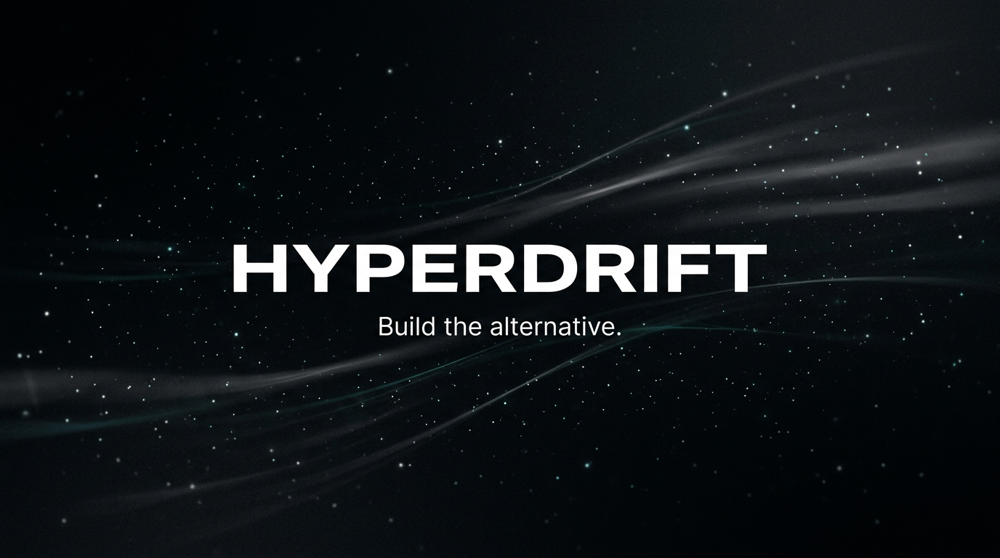

[hyperdrift.io](https://hyperdrift.io) · [Manifesto](https://hyperdrift.io/blog/manifesto) · [Blog](https://hyperdrift.io/blog)

---

The tools that used to require a team, a budget, and a network — don't anymore. Hyperdrift is a product studio that builds in that gap: focused apps, shipped fast, reaching the people they were built for.

Each one is a small act of refusal. To accept that access to great tools is a privilege. To accept that the friction is natural. To accept that the system, as currently arranged, is the best we can do.

---

## Apps

| App | What it does |
|-----|-------------|
| [**HyperCV**](https://hyper-cv.hyperdrift.io) | Tailors your CV to a specific role in 60 seconds. Turns generic experience into legible positioning. |
| [**Intel**](https://intel.hyperdrift.io) | Daily signal brief across AI, crypto, and tech. See what matters before it is obvious. |
| [**web3.capital**](https://web3.hyperdrift.io) | Ranks 8,000+ DeFi pools by capital efficiency score, not raw APY. Passkey-first. No extension required. |
| [**Revela**](https://revela.club) | Trust-first private communities. Curation over feed. Deliberate membership over scale. |

---

## Open source

| Repo | What it does |
|------|-------------|
| [**typer-companion**](https://github.com/hyperdrift-io/typer-companion) | Wizard-first orchestration for Typer CLI scripts — step validation, remembered context, graceful recovery. |
| [**hyper-post**](https://github.com/hyperdrift-io/hyper-post) | Publish to multiple social networks in one command. Built for builders who post where their users actually are. |
| [**keep-alive**](https://github.com/hyperdrift-io/keep-alive) | Keeps your services awake. Simple, dependency-light, does exactly one thing. |
| [**whats-that-again**](https://github.com/hyperdrift-io/whats-that-again) | The app that helps you remember exactly what it was. |
| [**peer-dependency-checker**](https://github.com/hyperdrift-io/peer-dependency-checker) | Audits peer dependency conflicts before you upgrade. Ship with confidence. |

---

## From the blog

[`ai`](https://hyperdrift.io/blog/tag/ai) · [`web3`](https://hyperdrift.io/blog/tag/web3) · [`agents`](https://hyperdrift.io/blog/tag/agents) · [`defi`](https://hyperdrift.io/blog/tag/defi) · [`building-in-public`](https://hyperdrift.io/blog/tag/building-in-public) · [`developer-tools`](https://hyperdrift.io/blog/tag/developer-tools) · [`series-ai-to-web3`](https://hyperdrift.io/blog/tag/series-ai-to-web3)

---

> *The apps are not the point. They are the salute.*
